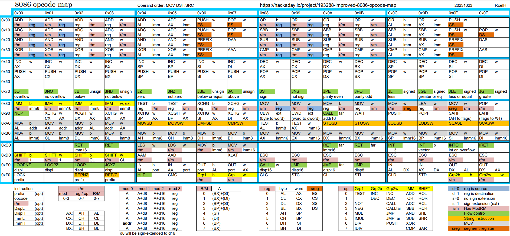

# Tiny VM
Maizuz wants a VM to run viruses on. Time to emulate 8086.
Written entirely in ANSI C, 0 dependency, -pedantic.

# Virtualization progress
"roleh" from [here](https://hackaday.io/project/193288-improved-8086-opcode-map) built a really nice map for 8086 instructions, helps a lot! So here's the current progress on the 8086 CPU:

Green means it's finished(mostly tested), red means that it will be implemented soon.

# Trigger warning
The VM might be innacurate, simulating things incorrectly while appearing to give the same result,
due to my ignorance or just me not getting the opportunity to learn an aspect of the CPU.
I tried/trying my best to make the logical part of things as true to the OG, but also as optimized
as possible.

# Project structure

- `tinyvm` : source/header directory, the files found there are shared.
  - `box` : the parent process that initializes everything and keeps track of user-end.
  - `sand` : the actual code for the virtualized environment, that is safely isolated.

----

<small>5'nizza...</small>
